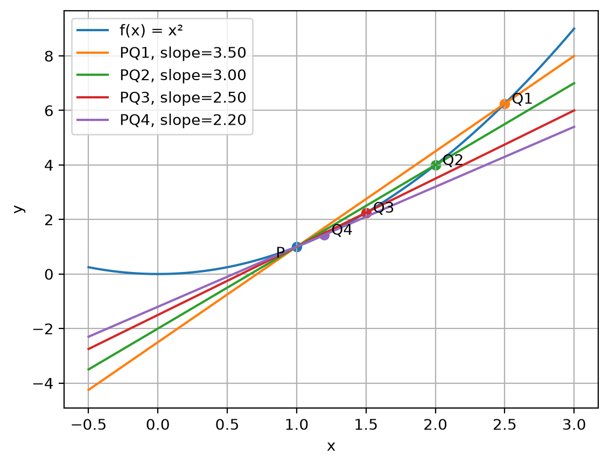
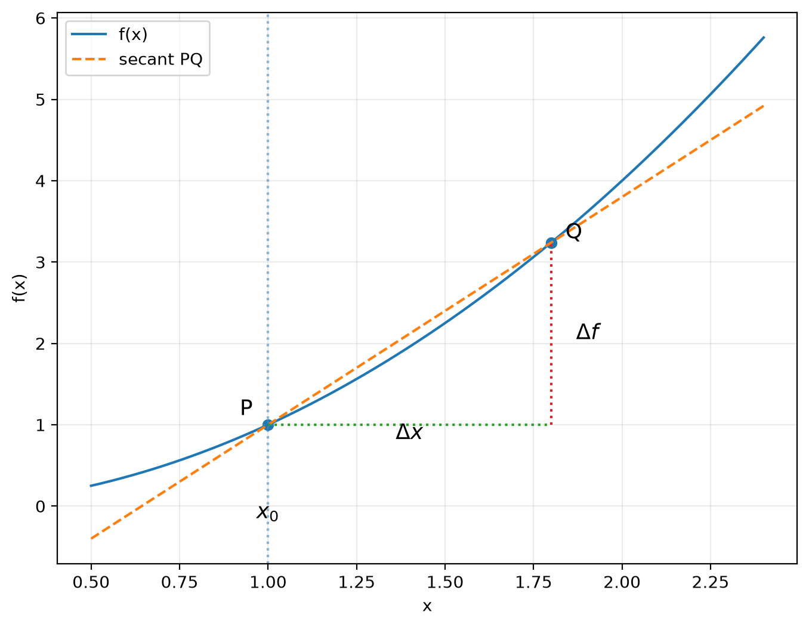
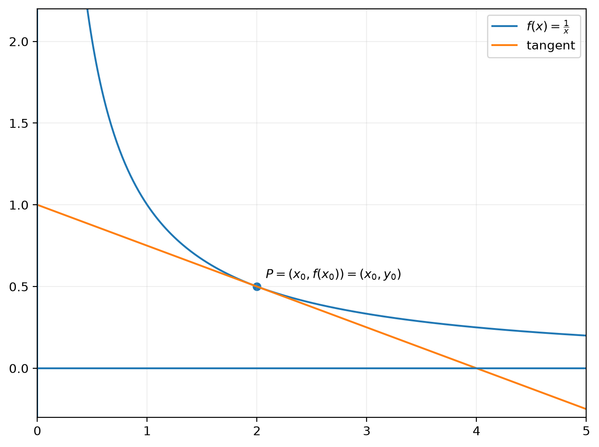

# 18.01 UNIT I DIFFERENTIATION 

## Major questions

1. What is a derivative?
2. How do we differentiate a function?

## Derivative notation 
> $\frac{d}{dx} \cdot e^{arctan \cdot x} = ?$

## Find the tangent line to $y = f(x)$ at $P = (x_0,y_0)$

### Tangent line equation 

> $y - y_0 = m(x - x_0)$  
> point $y_0 = f(x_0)$  
> slope $m = f'(x_0)$ 

### Definition 

> #### $f'(x_0)$ the derivative of at $x_0$, is the slope of the tangent line to $y = f(x)$ at P.
> 
>   
>   
> #### Tangent line = Limit of secant lines PQ as Q → P (P fixed)   

> 
>  
> #### The slope is just the ratio $\frac{\Delta f}{\Delta x}$ 
>
> The idea is that $m = \lim_{\Delta x \to 0}\frac{\Delta f}{\Delta x}$ is the slope of the tangent line.

### More explicit way to write $\Delta f$ and $\Delta x$ is

> $P = (x_0, f(x_0))$
> 
> #### $Q = (x_0 + \Delta x, f(x_0 + \Delta x))$
>
> $\boxed{f'(x_0) = \lim_{\Delta x \to 0}\frac{f(x_0 + \Delta x) - f(x_0)}{\Delta x} = m}$

### Example 1

#### $f(x) = \frac{1}{x}$

$\frac{\Delta f}{\Delta x} = \frac{\frac{1}{x_0+\Delta x}-\frac{1}{x_0}}{\Delta x}$

$\frac{\Delta f}{\Delta x} = \frac{1}{\Delta x}\left(\frac{x_0-(x_0+\Delta x)}{(x_0+\Delta x)x_0}\right)$

$\frac{\Delta f}{\Delta x} = \frac{1}{\Delta x}\left(\frac{-\Delta x}{(x_0+\Delta x)x_0}\right)$

$\frac{\Delta f}{\Delta x} = -\frac{1}{(x_0+\Delta x)x_0}$

Therefore,

$\boxed{f'(x_0) = \lim_{\Delta x \to 0}-\frac{1}{(x_0+\Delta x)x_0} = -\frac{1}{x_0^2}}$

$\boxed{f'(x_0) = -\frac{1}{x_0^2}}$

$\boxed{\text{Derivative at a point = instantaneous slope/rate of change at that point}}$

### Problem 1

#### Find areas of triangles enclosed by axes and the tangent to $y = \frac{1}{x}$

#### $y - y_0 = \frac{-1}{x_0^2}(x - x_0)$

#### Find x-intercept $(y = 0)$

#### We know that $y_0$ is $f(x_0)$ and $f(x_0)$ is $\frac{1}{x_0}$ so:

$0 - \frac{1}{x_0} = -\frac{1}{x_0^2}(x - x_0)$

$-\frac{1}{x_0} = -\frac{1}{x_0^2}(x-x_0)$

$-\frac{1}{x_0} = -\frac{x}{x_0^2}+\frac{1}{x_0}$

$-\frac{2}{x_0} = -\frac{x}{x_0^2}$

$\frac{2}{x_0} = \frac{x}{x_0^2}$

$\boxed{x=2x_0}$

#### To find the y-intercept $(x = 0)$, we proceed similarly.

Since

$y_0 = \frac{1}{x_0}$

substituting $x = 0$ into the tangent line equation gives:

$y - y_0 = -\frac{1}{x_0^2}(0 - x_0) = \frac{1}{x_0} = y_0$

Therefore,

$\boxed{y = 2y_0}$

So the y-intercept is

$\boxed{(0, 2y_0)}$

#### Symmetry explanation: 

$\boxed{y = \frac{1}{x} \Longleftrightarrow xy = 1 \Longleftrightarrow x = \frac{1}{y}}$

#### We can also get y-intercept by plugging $x=0$ into formula.

#### The area of the triangle: 

$\frac{1}{2}(2x_0)(2y_0) = 2x_0y_0 = 2$

### More notation

If

$y=f(x)$

then

$\Delta y = \Delta f$

and the derivative may be written as

$\boxed{f'(x) = \frac{df}{dx} = \frac{dy}{dx} = \frac{d}{dx}f(x) = \frac{d}{dx}y}$

- Lagrange notation: $f'(x)$
- Leibniz notation: $\frac{dy}{dx}$
- Differential operator: $\frac{d}{dx}$

### Example 2 

#### $f(x) = x^n$, $n = 1, 2, 3,$ and so on

> $\frac{d}{dx}x^n = ?$
>
> $\frac{\Delta f}{\Delta x} = \frac{(x + \Delta x)^n - x^n}{\Delta x}$

### Binomial Theorem

$\boxed{(x + \Delta x)^n = (x + \Delta x)\cdots(x + \Delta x) = x^n + nx^{n-1}\Delta x + O(\Delta x^2)}$

#### The junk is $O(\Delta x^2)$: terms containing

$(\Delta x)^2$, $(\Delta x)^3$, or higher powers.

$\frac{\Delta f}{\Delta x} = \frac{1}{\Delta x}\left((x+\Delta x)^n-x^n\right)$

$\frac{\Delta f}{\Delta x} = \frac{1}{\Delta x}\left(x^n + nx^{n-1}\Delta x + O(\Delta x^2) - x^n\right)$

$\frac{\Delta f}{\Delta x} = \frac{1}{\Delta x}\left(nx^{n-1}\Delta x + O(\Delta x^2)\right)$

$\frac{\Delta f}{\Delta x} = nx^{n-1} + O(\Delta x)$

#### As $\Delta x \to 0$:

$\boxed{\frac{d}{dx}x^n = nx^{n-1}}$

#### Extends to polynomials 

$\frac{d}{dx}(x^3 + 5x^{10}) = 3x^2 + 50x^9$
